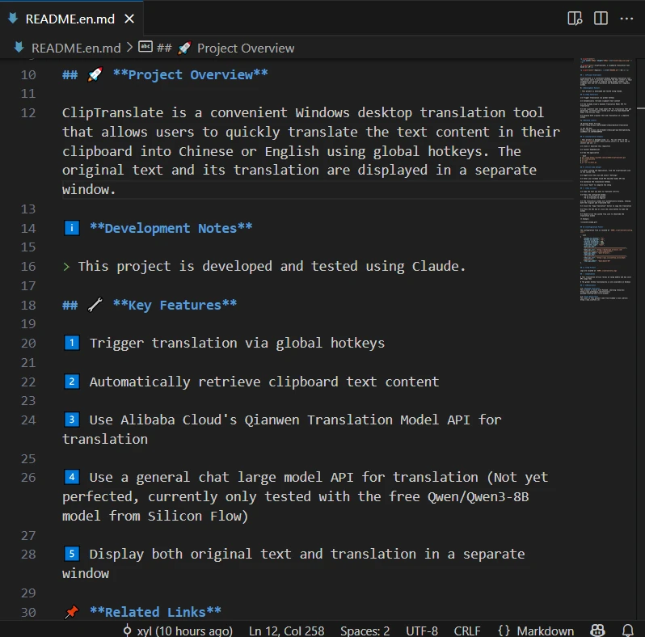

+++
author = "Yuanli Xiao"
date = '2025-06-04T01:15:07+08:00'
draft = false
title = 'Cliptranslate：一款基于大模型的剪切板翻译工具'
categories = [
    "项目"
]
image = ""
+++


## 🚀 **项目概述**

ClipTranslate 是一款 Windows 桌面便捷翻译工具，允许用户通过全局快捷键将剪贴板中的文本内容快速翻译成中文或英文，并在独立窗口中显示原文和译文。

> 本项目通过 Claude 开发与测试。

## 🔧 **主要功能**

- 通过全局快捷键触发翻译
- 自动获取剪贴板文本内容
- 调用阿里云千问翻译模型API进行翻译
- 调用通用聊天大模型API进行翻译（暂未完善，目前只测试过硅基流动的免费模型Qwen/Qwen3-8B）
- 在独立窗口中同时显示原文和译文

## 📥 **使用步骤**

### 下载可执行文件

- 在 Release 页下载最新的压缩包 https://github.com/xyl2024/ClipTranslate/releases
- 双击运行 ClipTranslate.exe

### 通过Python运行

> 本项目通过 uv 进行管理，你可以查看[官方使用手册](https://docs.astral.sh/uv/)学习 uv 的安装与使用。

1. 克隆或下载此仓库
2. 安装依赖包
3. 运行应用程序

```bash
$ git clone https://github.com/xyl2024/ClipTranslate.git
$ cd ClipTranslate
$ uv sync
$ uv run src/main.py
```

## ⚙️ **首次使用配置**

1. 运行应用程序后，在系统托盘区找到 ClipTranslate 图标
2. 右键点击图标，选择"设置"
3. 输入您的阿里云API密钥/聊天大模型API密钥
4. 可自定义翻译快捷键
5. 点击"保存"完成配置

## 💡 **使用方法**

1. 复制需要翻译的文本（Ctrl+C）
2. 按下配置的快捷键：
   - F2键 翻译为中文
   - F4键 翻译为英文
3. 翻译窗口将自动显示，流式输出原文和译文
4. 点击"复制译文"按钮复制译文
5. 按ESC键或点击关闭按钮可隐藏窗口
6. 双击系统托盘图标可显示/隐藏翻译窗口

🎥 示例：

<!--  -->


## 📂 **配置文件**

配置文件位于 `HOME/.cliptranslate/config.json`：

```json
{
    "hotkey_to_chinese": "f2",
    "hotkey_to_english": "f4",
    "chinese_threshold": 300,
    "english_threshold": 1000,
    "translator_type": "chat",
    "qwen_api_key": "sk-************************************************",
    "qwen_api_url": "https://dashscope.aliyuncs.com/compatible-mode/v1/chat/completions",
    "qwen_api_model": "qwen-mt-plus",
    "chat_api_key": "sk-************************************************",
    "chat_api_url": "https://api.siliconflow.cn/v1/chat/completions",
    "chat_api_model": "Qwen/Qwen3-8B"
}
```

## 📝 **日志文件**

日志位于 `HOME/.cliptranslate_logs`

## ⚠️ **注意事项**

❗ 该翻译服务依赖于大模型，会产生API调用费用

❗ 全局快捷键功能仅在 Windows 平台上可用

## 🎨 **资源**

- **PySide6教程**
本项目基于PySide6构建，参考[学习资源](https://www.pythonguis.com/tutorials/pyside6-creating-your-first-window/)。

- **图标资源**
本项目icon来自[阿里巴巴矢量图标库](https://www.iconfont.cn/)。
本项目logo来自[text-to-svg](https://github.com/JiuRanYa/text-to-svg)

- **大模型**
  - [Qwen-MT模型](https://help.aliyun.com/zh/model-studio/machine-translation)
  - [硅基流动-Qwen/Qwen3-8B模型](https://cloud.siliconflow.cn/models?target=Qwen/Qwen3-8B)
